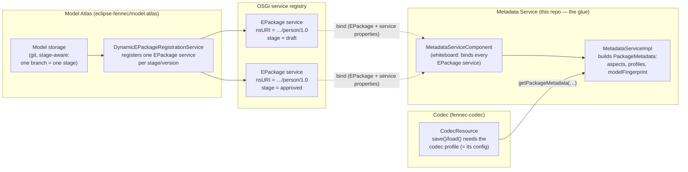
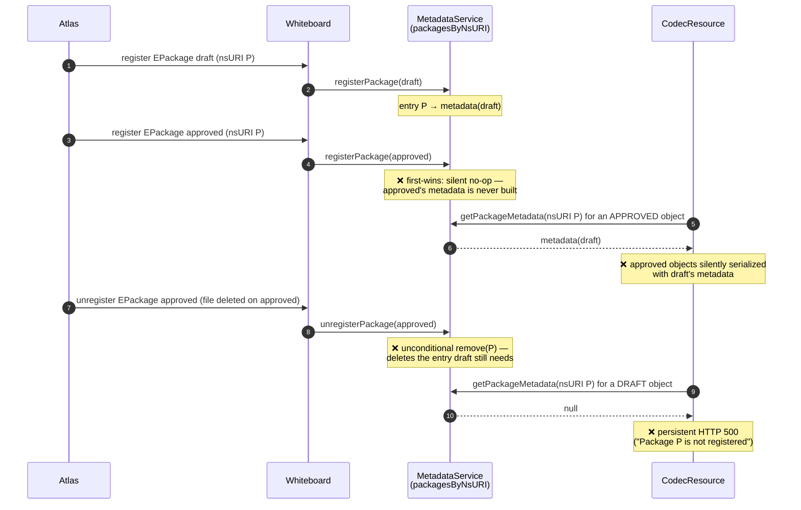
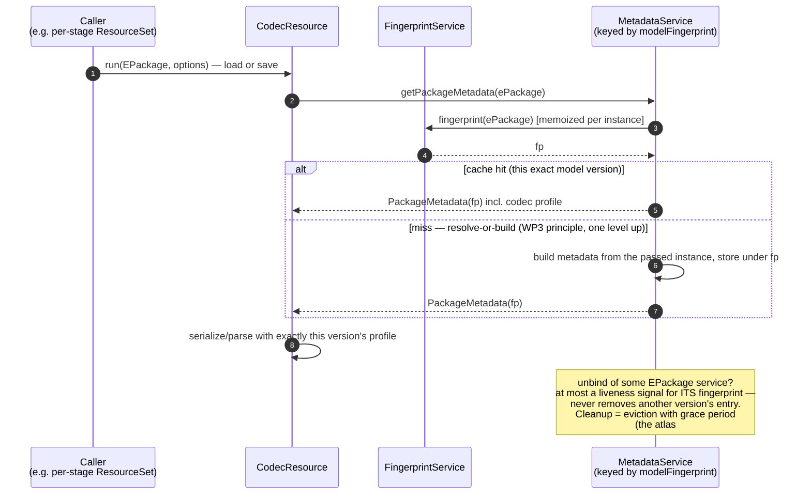

# Big Picture: Model Atlas → Metadata Service → Codec

> The end-to-end story of how a model version travels from the Model Atlas through
> the Metadata Service to a codec run — why the current nsURI-keyed chain breaks as
> soon as two versions of the same model are live, and what each party has to change.
> This repo is the **glue code** between the Atlas and the codec; the mechanics of
> fingerprinting and artifact reuse are described in
> [Mediator, Fingerprinting & the Derived-Artifact Lifecycle](mediator-and-fingerprinting.md).

## The three parties

Two different registries have to stay joinable here:

- the **EPackage side** — the model services the Atlas publishes (one per stage/version), and
- the **derived side** — the `PackageMetadata` (with the codec profile) that the
  Metadata Service builds from each package and that `CodecResource` serializes with.

Everything below is about **what the reference between those two sides is keyed by**.

## Why nsURI as the key breaks: an observed production failure

The scenario from
[model.atlas#156](https://github.com/eclipse-fennec/model.atlas/issues/156)
(read-only git storage e2e test): one model, `http://example.org/person/1.0`, on two
branches with **diverging content** — `draft` has `Person.name`, `approved` has
`Person.fullName`. Both are legitimately live at the same time; the Atlas registers
one `EPackage` service per stage *by design*. Then the schema file is deleted on
`approved` only.

Three code facts produce this, all in `MetadataServiceImpl`:

| Fact | Effect |
|---|---|
| `packagesByNsURI` is a flat `Map<String, PackageMetadata>` | the derived side can only represent **one** version per nsURI |
| `registerPackage` is **first-wins** | the second version's fingerprint is never even computed; its objects get the *other* version's metadata |
| `unregisterPackage` does an unconditional `remove(nsURI)` | any one version's unbind deletes the entry every other live version needs |

Note that the `modelFingerprint` introduced in WP5 is computed and stored — but it
sits *behind* the first-wins check. It is metadata about the entry, **not the key of
the registry**. That is exactly what WP6 changes.

> The same flat-put / unconditional-remove pattern exists in other nsURI-keyed
> `EPackage`-whiteboard consumers (Atlas: `DynamicEPackageRegistrationService`,
> `DynamicEPackageConfigurator`; codec: `TypeDiscriminatorService`'s
> `EPackage.Registry.INSTANCE` fallback). **Any consumer that whiteboard-tracks
> EPackage services and keys by nsURI is broken by multi-version registration.**

## The target: fingerprint-keyed, pull-based, stateless codec runs

The fingerprint (see [fingerprinting](mediator-and-fingerprinting.md#fingerprinting))
is reproducible and content-derived: two diverging branch versions get two
fingerprints; identical content on two branches gets one. Keyed by it, the
multi-version case is correct *by construction* — there is nothing a second
registration or an unbind can corrupt.

The consumer model flips from push (register first, look up by name later) to
**pull**: every codec run is stateless — it receives the concrete `EPackage`
instance and its runtime options as parameters, and obtains its configuration (the
codec profile) from the Metadata Service via the fingerprint of exactly that
instance. No global `EPackage.Registry`, no prior registration required.

Key properties:

- **The version question is answered at the caller**, where it belongs: whoever hands
  the codec run its `EPackage` (e.g. the per-stage `ResourceSet` the Atlas configures)
  has already chosen the version. The codec never guesses by name.
- **The codec computes the fingerprint locally** (via the Metadata Service). The
  Atlas-published service property `fennec.model.fingerprint` remains a
  **cross-check** for detecting canonicalization drift — it is never trusted as the
  key (decision recorded in atlas#156). A drift shows up as a loud lookup miss, not
  as silent wrong-version serialization.
- **Unregister disappears as a correctness concern.** A service unbind is a liveness
  signal for one fingerprint; actual removal becomes cache eviction with a grace
  period, converging on the `git gc`-style orphan housekeeping planned in atlas#156.
- **The whiteboard becomes a warm-up optimization**: binding an `EPackage` service may
  pre-build its metadata so the first codec run pays no build cost — but nothing is
  correctness-relevant about it anymore.
- nsURI-based lookups (`getPackageMetadata(String)` & friends) stay for REST-ish
  consumers, documented as **best effort** under ambiguity.

## Who does what

| Party | What | Where it is tracked |
|---|---|---|
| **This repo** (glue) | WP6: registry keyed by `modelFingerprint` (nsURI = secondary index), `registerPackage` dedupes by fingerprint instead of first-wins, unregister = per-fingerprint liveness (never cross-version removal), new API `getPackageMetadata(EPackage)` (resolve-or-build) + `getPackageMetadataByFingerprint(String)`. Acceptance: the multi-version repro test from atlas#156. | [model.metadata#15](https://github.com/eclipse-fennec/model.metadata/issues/15) (parent: [#9](https://github.com/eclipse-fennec/model.metadata/issues/9)) |
| **Model Atlas** | (a) Fix its own nsURI-keyed registration map so a second version per nsURI is actually published; (b) optionally emit `fennec.model.fingerprint` as a service property (cross-check only); (c) independently: the dedicated fingerprint field in the EObject registry for orphan housekeeping. **Timing:** coordinated separately — ongoing developments there must not be disrupted; to be scheduled via the weekly. | dedicated ticket in model.atlas (to be created; referenced from [model.atlas#156](https://github.com/eclipse-fennec/model.atlas/issues/156)) |
| **Codec** | (a) Drop its bundled copy of `org.eclipse.fennec.model.metadata` and build against this repo's `…metadata.api` + `…metadata` bundles (same Java packages — imports stay unchanged, it is buildpath work); (b) `CodecAspectProvider` implements the new abstract `buildOperationAspect` (may return `null`); (c) `CodecResource.requirePackageRegistered` switches from `getPackageMetadata(nsURI)` to `getPackageMetadata(ePackage)` — the "register first" precondition disappears; (d) audit `TypeDiscriminatorService` for nsURI keying. | dedicated tickets in the codec repo (to be created) |

Because this repo's API is a **superset** of the codec's bundled copy, the codec
migration can start before its lookup call sites are switched — the nsURI lookup keeps
working for the single-version case throughout (an explicit WP6 acceptance criterion).

## Reading path

1. [Overview / purpose](model-metadata-purpose.md) — why the Metadata Service exists.
2. [Architecture](model-metadata-architecture.md) — the metadata/aspect/profile data model.
3. [Mediator & fingerprinting](mediator-and-fingerprinting.md) — fingerprint function,
   two-fingerprint scheme, resolve-or-build, `ArtifactStore`.
4. This document — the cross-repo picture and the multi-version problem.
5. [model.metadata#15](https://github.com/eclipse-fennec/model.metadata/issues/15) — the
   implementation work package (WP6).
